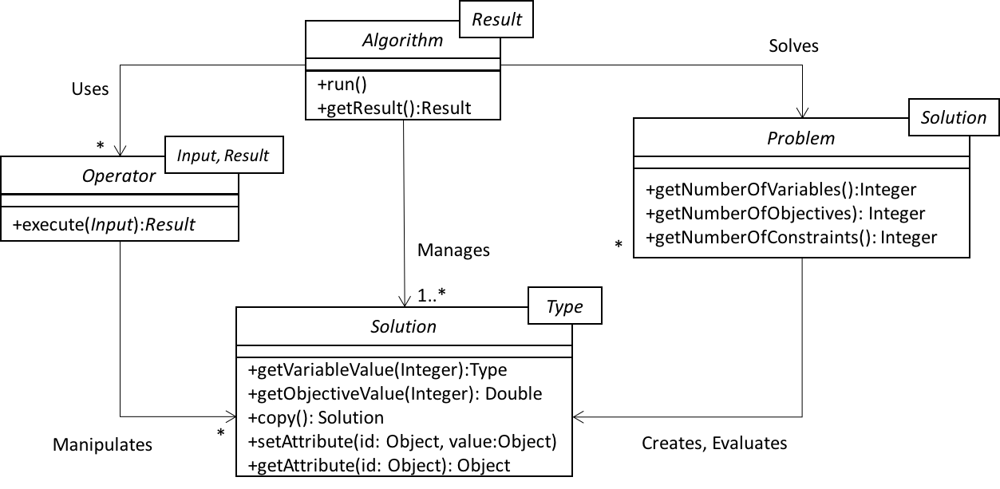

# jMetalPy: Python version of the jMetal framework

I have just started a new project called jMetalPy. The initial idea is not to write the whole jMetal proyect in Python, but to "have fun": I'm starting with Python, and to learn this programming language I think that using jMetal as a case study would be nice.

Any ideas about how the structure the project, coding style, useful tools (I'm using PyCharm), or links to related projects are welcome. The starting point is the jMetal architecture:

---

# Last changes (June 1st 2017)
* The package organization has been simplified to make it more "Python-ish". The former oarganization was a clone of the original Java-based jMetal project.
* The [`EvolutionaryAlgorithm`](https://github.com/jMetal/jMetalPy/blob/master/jmetal/core/algorithm.py) class interits from `threading.Thread`, the any evolutionary algorithm can run as a thread. This class also contains an `Observable` field, so observer entities can register and will notified with algorithm information. 
* [Four examples](https://github.com/jMetal/jMetalPy/blob/master/jmetal/core/algorithm.py) of configuring and running three different single-objective algorithms are provided.

# Current status (June 1st 2017)
The current implementation contains the following features: 
* Algorithms (single-objective)
  * (mu+lamba)Evolution Strategy
  * (mu,lamba)Evolution Strategy
  * Generational Genetic algorithm
* Problems (multi-objective)
  * Kursawe
  * Fonseca
  * Schaffer
  * Viennet2
* Problems (single-objective)
  * Sphere
  * OneMax
* Encoding
  * Float
  * Binary
* Operators
  * SBX Crossover
  * Single Point Crossover
  * Polynomial Mutation
  * Bit Flip Mutation
  * Simple Random Mutation
  * Null Mutation
  * Uniform Mutation
  * Binary Tournament Selection

# Developers

All developers should follow these guidelines:

  - [Follow style guide for python code: PEP8](resources/pages/code_style.md)
  - [Object-oriented programming](resources/pages/poo.md)
  - [Incorporate the new features of Python 3.5](resources/pages/features_python3.md)
  - [Respect the initial structure](resources/pages/project_structure.md)

