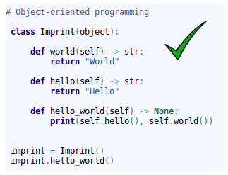
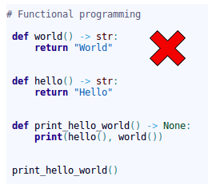
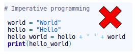
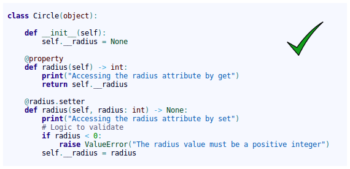
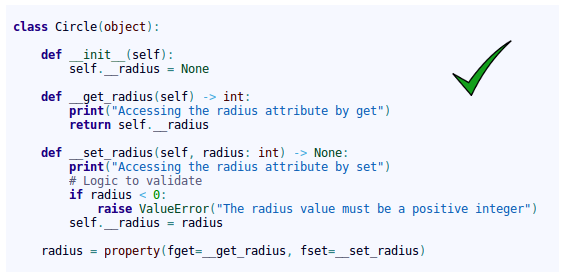
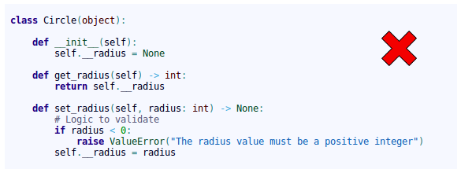

# jMetalPy: Python version of the jMetal framework

I have just started a new project called jMetalPy. The initial idea is not to write the whole jMetal proyect in Python, but to "have fun": I'm starting with Python, and to learn this programming language I think that using jMetal as a case study would be nice.

Any ideas about how the structure the project, coding style, useful tools (I'm using PyCharm), or links to related projects are welcome. The starting point is the jMetal architecture:

---

## Developers

All developers should follow these guidelines:

  - Follow style guide for python code: [PEP8](https://www.python.org/dev/peps/pep-0008)
  - Object-oriented programming
  - Incorporate the new features of Python 3.5
  - Respect the initial structure

### PEP8!

It is really important to follow some standards when a team develops an application. If all team members format the code in the same format, then it is much easier to read the code. PEP8 is Python's style guide. It's a set of rules for how to format your Python code.

Some style rules:

  - Package and module names:  
Modules should have short, **all-lowercase** names. Underscores can be used in the module name if it improves readability. Python packages should also have short, **all-lowercase** names, although the use of underscores is discouraged. In Python, a module is a file with the suffix '.py'.

  - Class names:  
Class names should normally use the **CapWords** convention. 

  - Method names and instance variables:  
**Lowercase with words separated by underscores** as necessary to improve readability. 

There are many more style standards in PEP8! &nbsp; &rarr; [PEP8 documentation](https://www.python.org/dev/peps/pep-0008).  
The most appropriate is to use an IDE that has support for PEP8. For example, [PyCharm](https://www.jetbrains.com/pycharm/).

### Object-oriented programming!

**Object-oriented programming should be the single programming paradigm used**. Avoiding as far as possible, imperative and functional programming.

In classes, we directly access the attributes, which are usually defined as public.

Only in the case that we want to implement additional logic in the accesses to the attributes we define getter/setter methods, **but always through the use of the property annotation or the property function**:

By using property, we continue to access the attributes directly:

Do not use getter/setter methods without the property annotation or the property function:

Since this way of accessing the attribute is not commonly used in Python:

### Python 3.5!

> **Note:** <i>Pending definition.</i>

### Structure!

> **Note:** <i>Pending definition.</i>

