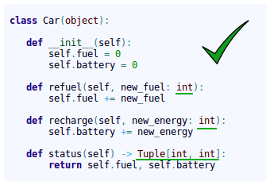
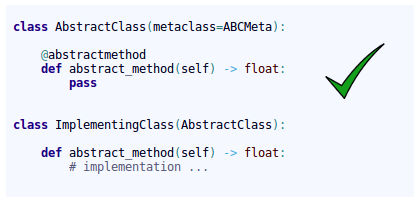
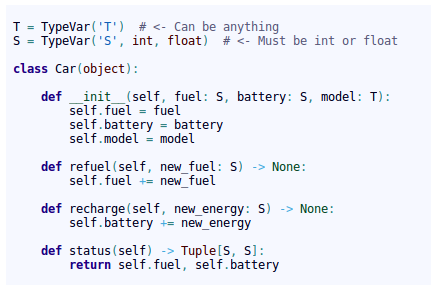
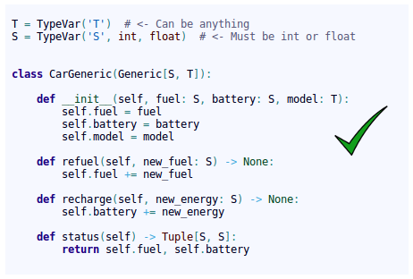

## Python 3.5!

We use the new features of python 3. Concretely, up to version **3.5**.

### Typing

We **always** define types in the parameters of the arguments and the return value:

### Abstract class

We can define abstract classes (ABCs) in Python:

In the case that we want to define an **interface** class, it is done in the same way. We just have to define all the methods of the class as abstract.

### Generic classes and types

Example of use of generic types:

In the code below, the IDE displays a **warning**, since although the 2nd parameter is a float type, which is a type allowed in the definition of the generic type X, it is not of the same type as the first, since the first 2 parameters must be of the same generic type (S):

In the code below, the IDE displays a **warning**, since the 2nd parameter is a type not allowed in the definition of the generic type ( *TypeVar('S', int, float)* ):

Example of use of **generic class**. When the class inherits from *Generic[...]*, the class is defined as generic. In this way we can indicate the types that will have the values of the generic types, when using the class as type. Look at the *add_car()* method of the *Parking* class.

NOTE: The generic classes inherit from abc.ABCMeta, so they are abstract classes and **abstract methods can be used** .

In the code below, the IDE displays a **warning** in the call to the *add_car()* method when adding the car, since the 3rd parameter of the init must be a *str* type, as defined in the *add_car()* method of the *Parking* class.

When inheriting from generic classes, some type variables could be fixed:

Example of inheritance from non-generic class to generic class:

Example of inheritance from generic class to another generic class:

There are more features in Python3.5! &nbsp; &rarr; [Python3.5 documentation](https://docs.python.org/3.5/contents.html).  